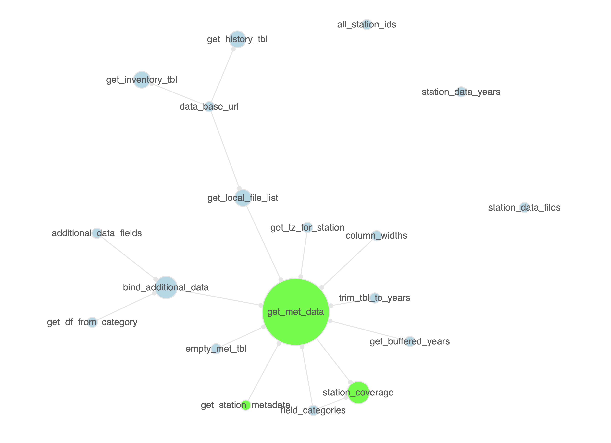

<!-- README.md is generated from README.Rmd. Please edit that file -->

```{r setup, include = FALSE}
knitr::opts_chunk$set(
  collapse = TRUE,
  comment = "#>",
  fig.path = "man/figures/README-",
  out.width = "100%"
)
```

[](https://cran.r-project.org/package=pkgattrs)
[](https://travis-ci.org/rich-iannone/pkgattrs)
[](https://ci.appveyor.com/project/rich-iannone/pkgattrs)

```{r packages, message=FALSE, warning=FALSE, include=FALSE}
library(pkgattrs)
library(tidyverse)
```

# pkgattrs

The **pkgattrs** package is useful for getting information on the contents of any R package. One of the things that can be done is generating a summary of functions available in one or more packages. We can conveniently do this using the `pkgattrs()` function. Here is an example where we can create an informative table of the functions in the `pkgattrs` and `blastula` packages (hosted on GitHub).

```{r echo=TRUE, results="hide"}
fcn_info <-
  pkgattrs(
    from_github("rich-iannone/pkgattrs"),
    from_github("rich-iannone/blastula")
  )
```

The resulting tibble contains the following information in each record:

- the package name (`pkg_name`)
- the package source location (`pkg_src`)
- the function name (`fcn_name`)
- whether the function is exported or not (`exported`)
- the file that contains the function (`r_file`)
- the relative path from pkg root to `r_file` (`r_file_path`) 
- the line number in `r_file` where the function starts (`ln_start`) and ends (`ln_end`)
- the number of lines used for the function (`fcn_lines`)
- the number of lines in the function used for code (`code`), for comments (`comment`), and for roxygen statements (`roxygen`), and, the `fcn_lines` lines that are blank (`blank`): the sum of all these is given in `total_lines`
- optionally, the cyclomatic complexity of the function (`cyclocomp`)
- the name of the package repository, if it was obtained from one (`pkg_repo`)
- the name of the package path, if it was a locally-available package (`pkg_path`)
- the number of package functions that are called in `fcn_name` (`n_pkg_fcns_called`)
- a list column with the names of the package functions called in `fcn_name` (`pkg_fcns_called`)

```{r}
fcn_info
```

The package also supplies functions for visualizing the relationships between a package's functions as a network graph. For example, we could obtain a function information tibble for the **stationary** package, transform that to a graph, and then examine this network with the `function_graph_all()` function.

```{r eval=FALSE}
pkgattrs(from_github("rich-iannone/stationary")) %>%
  function_graph_all()
```



In this graph, the green nodes show the functions that are exported, and, the relative sizing of nodes is scaled the number of package functions called by each. Each edge represents the relationship `called_in`.

We can also focus on a subgraph with a single function. The function `function_graph_single()` can be used with the function graph object, taking a function name to show all the package functions that the function calls. In the following example, we can examine which functions are called by the `print.ptblank_agent()` method.

```{r eval=FALSE}
pkgattrs(from_github("rich-iannone/pointblank")) %>%
  function_graph_single(target_fcn = "print.ptblank_agent")
```


Finally, the package has a means to write out a given package's API with the `write_pkg_api()` function. For the **pkgattrs** package (this package), we can generate a file that lists the exported functions along with each of the function arguments and default values.

```{r eval=FALSE}
write_pkg_api(filename = "API")
```

This example generates the following text in the `API` file:

```
from_github(repo)
function_graph_all(pkgattrs_tbl, pkg_name = NULL)
function_graph_single(pkgattrs_tbl, target_fcn, pkg_name = NULL)
pkgattrs(..., .make_clean = TRUE, .get_cyclocomp = FALSE)
write_pkg_api(..., filename = "pkg_api")
```

## Installation

You can install **pkgattrs** from GitHub with:

```{r gh-installation, eval = FALSE}
devtools::install_github("rich-iannone/pkgattrs")
```
